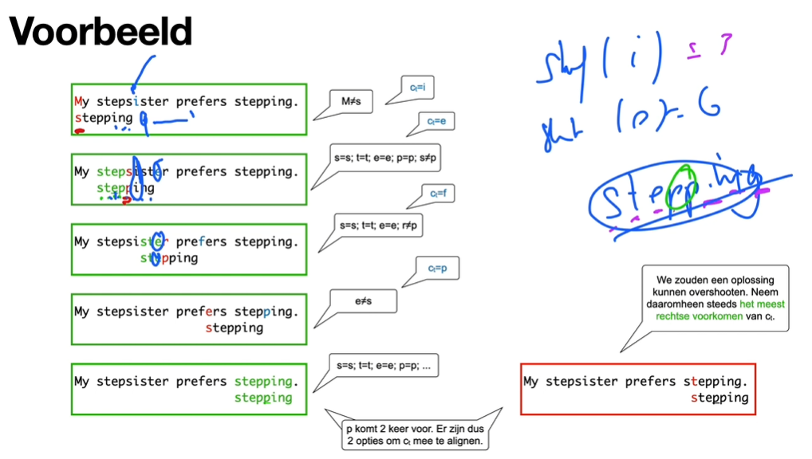
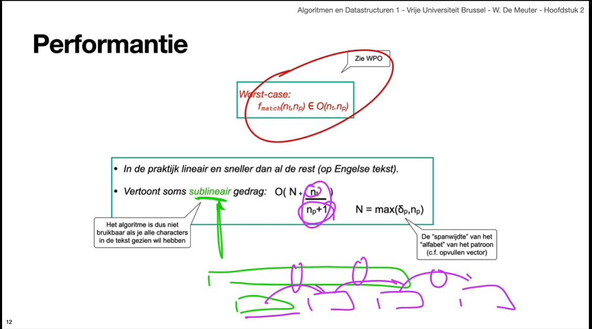

# QuickSearch algorithm

The QuickSearch algorithm is a simple algorithm used for pattern recognition. Statisticly, it is the fastest algorithm for pattern recognition. Although in the worst case scenario, it is slower than the bruteforce algorithm because it has to compare every character in the text with the first character of the pattern, just like the bruteforce algorithm, but also has to compute the shift value for every character in the text.



```scheme
(define (QuickSearch t p)
  (define n-t (string-length t)) ; length of text
  (define n-p (string-length p)) ; length of pattern
  (define shift (compute-shift p)) ; compute shift table
  (let loop
    ((i-t 0) ; index in text
     (i-p 0)) ; index in pattern
    (cond
      ((> i-p (- 1 n-p)) ; if index in pattern is equal to length of pattern - 1
        i-t) ; return index in text
      ((> i-t (- n-t n-p)) ; if index in text is greater than length of text - length of pattern
       #f) ; return false, this means the pattern is not found in the text
      ((eq? (string-ref t (+ i-t i-p)) (string-ref p i-p)) ; if character in text is equal to character in pattern
           (loop i-t (+ i-p 1)))) ; continue with next character in pattern
      (else ; if character in text is not equal to character in pattern
       (let ((c-t (string-ref t (modulo (+ i-t n-p) n-t)))) 
         ; create variable c-t, which is the character in text at index i-t + length of pattern. 
         ;The modulo is used in case i-t + length of pattern is greater than length of text, when this happens, the next step in the loop will throw #f
         (loop (+ i-t (shift c-t)) 0))))) ; set index in text to i-t + shift of c-t, and set index in pattern to 0
```

In large parts the QuickSearch algorithm is the same as the Bruteforce algorithm. The difference is that the QuickSearch algorithm uses a shift functions to determine the next index in the text to compare with the pattern. In the implementation above, the shift function is called `compute-shift`, and is a hifher order functions that returns a lambda function. This lambda function is used to determine the shift value for a given character.

```scheme
(define (compute-shift-function p)
  (define n-p (string-length p)) ; length of pattern
  (define min-ascii (char->integer (string-ref p 0))) ; ascii value of first character in pattern
  (define max-ascii (char->integer (string-ref p 0))) ; ascii value of first character in pattern
  
  (define (create-table index) 
    (if (< index n-p) ; if index is less than length of pattern
        (begin
          (set min-ascii (min min-ascii (char->integer (string-ref p index)))) ; See if the current character  has a lower ascii value than the current min-ascii
          (set max-ascii (max max-ascii (char->integer (string-ref p index)))) ; See if the current character  has a higher ascii value than the current max-ascii
          (create-table (+ index 1))) ; continue with next character in pattern
        (make-vector (- max-ascii min-ascii -1) (+ n-p 1)))) 
        ; A vecor is created with the length of the difference between max-ascii and min-ascii. 
        ;The value of each index is set to length of pattern + 1
    
  (define (fill-table index)
    (if (< index n-p)
      (let ((ascii (char->integer (string-ref p index)))) ; ascii value of character in pattern at index
        (vector-set! shift-table (- ascii min-ascii) (- n-p index)) ; set value in vector at index asciil - min-ascii to length of pattern - index
        (fill-table (+ index 1))))) ; continue with next character in pattern
    
  (define shift-table (create-table 0)) ; create shift table
  (fill-table index) ; fill shift table whith shift values
  (lambda (c) ; return lambda function
    (let ((ascii (char->integer c-t))) ; ascii value of character in text at index
      (if (>= max-ascii ascii min-ascii) ; if ascii value of character in text at index is greater than or equal to min-ascii
          (vector-ref shift-table (- ascii min-ascii)) ; return value in vector at index asciil - min-ascii
          (+ n-p 1))))) ; else return length of pattern
```

Lets do a step by step run through of the `compute-shift-function` for the example pattern `michiel`:

1. `n-p` is set to 7
2. `min-ascii` is set to the ascii value of the first char in the string. This being `m`, the ascii value is 109
3. `max-ascii` is set to the ascii value of the first char in the string. This being `m`, the ascii value is 109
4. The `create-table` function is defined
5. The `fill-table` function is defined
6. The `shift-table` is set to the result of the `create-table` function with index `0`
7. Check if index(`0`) is less than length of pattern(`7`), this is true
8. Set `min-ascii` to the minimum of `min-ascii` and the ascii value of the character in the pattern at index(`0`). This is `109`, which is the ascii value of `m`, the same as `min-ascii`
9. Set `max-ascii` to the maximum of `max-ascii` and the ascii value of the character in the pattern at index(`0`). This is `109`, which is the ascii value of `m`, the same as `max-ascii`
10. The `create-table` function is called with index `1`
11. This is repeated until `index` is equal to length of pattern(`n-p`) and returns a vector with the length of the difference between `max-ascii` and `min-ascii`, and the value of each index set to length of pattern(`n-p`) + 1, wich is `8`
12. The `fill-table` function is called with index `0`
13. Check if index(`0`) is less than length of pattern(`7`), this is true
14. Set `ascii` to the ascii value of the character in the pattern at index(`0`). This is `109`, which is the ascii value of `m`
15. Set the value in the vector at index `ascii - min-ascii`, which is `0`, to `7` (`n-p` - `index`, which is `7` - `0`)
16. The `fill-table` function is called with index `1`
17. This is repeated until `index` is equal to length of pattern(`n-p`), and the vector is filled with the shift values for each character in the pattern
18. The `compute-shift-function` returns a lambda function that looks up the shift value for a given character in the pattern

## Performance

The worst case scenario for the QuickSearch algorithm is when the pattern is not found in the text, and the shift function always returns 1. In this case the algorithm will have to compare every character in the text with the first character of the pattern, and compute the shift value for every character in the text. This will result in a time complexity of `O(nt*np)`, where `nt` is the length of the text and `np` is the length of the pattern.

In cases where the the `c-t` is not in the pattern, the shift function will return the length of the pattern. This will result in a time complexity of `O(nt/np +1)`, where `nt` is the length of the text, and `np` is the length of the pattern. This is the best case scenario for the QuickSearch algorithm.



There is a hidden cost whoever. The shift function has to be computed before the QuickSearch algorithm can be used. The time complexity of the shift function depends on the size of the alphabet, this is why the time complexity of the compute shift function is `N=_max_(size_of_alphabet, length_of_pattern)`.

Combining the time complexity of the shift function and the QuickSearch algorithm, the time complexity of the QuickSearch algorithm is `O(nt/(np+1) + N)`, where `nt` is the length of the text, `np` is the length of the pattern, and `N`=`max(size_of_alphabet, length_of_pattern)`