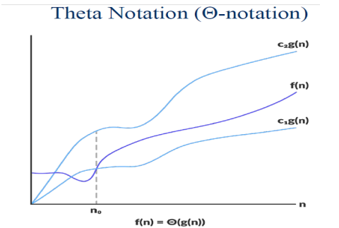
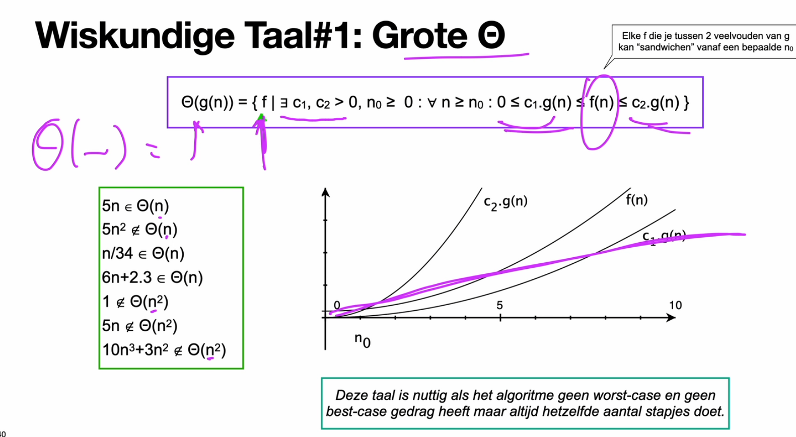
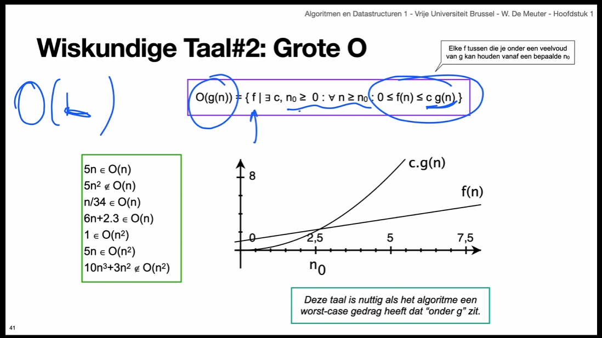
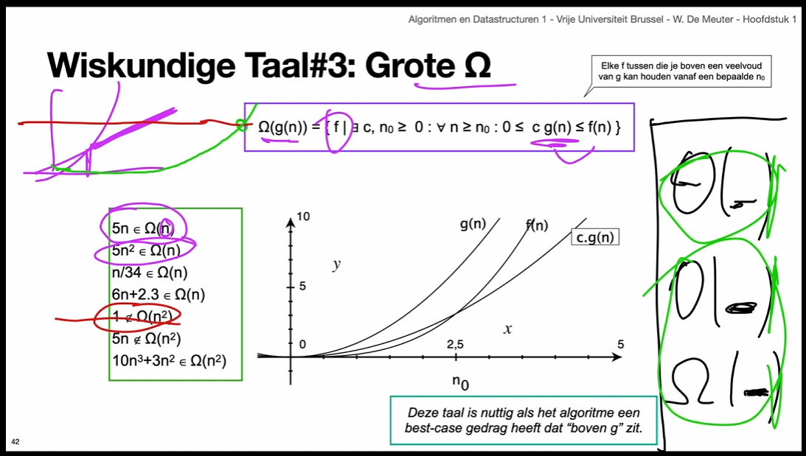
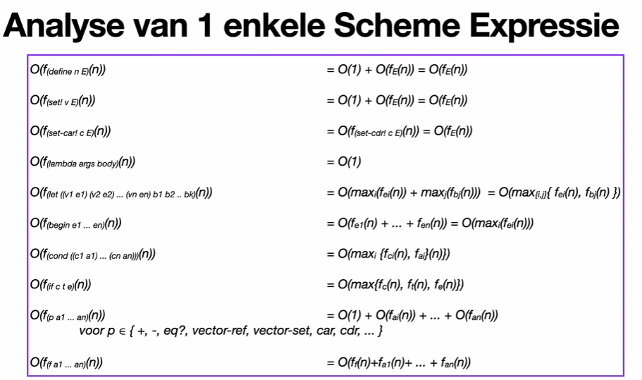

# Performance of Algorithms

An algorith can not be evaluated using absolute measurements like the time it takes to run. This on the hardware it is running on, and the input. To circumvent this we count the steps an algorithm takes to complete a task with a given input **n**. This is called the **running time** or **performance characteristic** of the algorithm. Lets analyse the following algorithm:

```scheme
(define (greatest lst)
    (define (iter el l)
        (cond
            ((null? l) el)
            ((< el (car l)) (iter (car el) (cdr l)))
            (else (iter el (cdr l)))))
    (iter 0 lst))
```

This algorithm takes a list of numbers and returns the greatest number in the list. The algorithm iterates over the list and compares the current element with the greatest element found so far. If the current element is greater than the greatest element found so far, the current element becomes the greatest element found so far. The algorithm is implemented using an iterating function that iterates over the list by calling itself with the tail of the list, until the tail of the list is empty.

Now we can count the steps the algorithm takes to complete one iteration. For this we count each operation as one step. The algorithm takes 3 steps to complete one iteration if the list is empty. 
1. Call the function iter
2. Check if the list is empty
3. Return the greatest element found so far

If the list is not empty, the amount of steps taken each iteration depends on the value of the current element. If the current element is greater than the greatest element found so far, the algorithm takes 7 steps to complete one iteration. 

1. Call the function iter
2. Check if the list is empty
3. Get the first element of the list (`car`)
4. Check if the greatest element found so far is smaller than the first element of the list (yes)
5. Again get the first element of the list (`car`)
6. Get the tail of the list (`cdr`)
7. Call the function iter

If the current element is smaller the algorithm takes 6 steps to complete one iteration.

1. Call the function iter
2. Check if the list is empty
3. Get the first element of the list (`car`)
4. Check if the greatest element found so far is smaller than the first element of the list (no)
5. Get the tail of the list (`cdr`)
6. Call the function iter

So the **performance characteristic** of the algorithm is ether 7n + 3 or 6n + 3. The first one being the worst case scenario and the second one being the best case scenario. Using both of these we can calculate the average performance characteristic of the algorithm. This is done by taking the average of the two. This gives us 6.5n + 3. This is the average amount of steps the algorithm takes to complete one iteration. This is usually not done.

As you might have noticed is this a slow way to count, defenetly if the algorithm is more complex. For this reason we will look in what catergory the algorithm falls _(n, log(n), sqrt(n), n.log(n), n^2, n^3, 2^n, n!)_. If you know the category of the algorithm, you can estimate how it will scale with larger inputs, and what formulas behave similarly.

## Big theta Notation

Θ(g(n)) is a set of functions that behave similar to g(n). One we hae defined this set we can then express that f(n) simular to g(n) by writing **f(n) ∈ Θ(g(n))**. This Theta collections is defined as follows:



**Θ(g(n)) = {f(n): there exist positive constants c1, c2 and n0 such that 0 <= c1g(n) <= f(n) <= c2g(n) for all n >= n0}**



Take a linear function f(n) = 3n + 2. This function is in the set Θ(n). This is because there exist positive constants c1, c2 and n0 such that 0 <= c1n <= 3n + 2 <= c2n for all n >= n0. For example c1 = 1, c2 = 4 and n0 = 1. This is because 0 <= 1n <= 3n + 2 <= 4n for all n >= 1. 

But a parabolic function f(n) = 3n^2 + 2n + 1 is not in the set Θ(n). This is because there exist no positive constants c1, c2 and n0 such that 0 <= c1n <= 3n^2 + 2n + 1 <= c2n for all n >= n0. This is because 3n^2 + 2n + 1 is always greater than n for all n >= 1. So you could bound it by a linear function from below, but not from above, and therefore does not belong to the set Θ(n), but the set Θ(n^2).

From the tree tools we can see that the set Θ(n) is the intersection of the sets O(n) and Ω(n), making it the most accurate set to describe the performance characteristic of an algorithm.

## Big O Notation

The Big O notation can be seen as a broken version of th e Big Theta notaion, and only the upper limit of a funtion. The Big O notation is written as O(g(n)). This is defined as follows:

**O(g(n)) = {f(n): there exist positive constants c and n0 such that 0 <= f(n) <= cg(n) for all n >= n0}**

i.e all function that are smaller than or equal to cg(n) for all n >= n0. This means that f(n) = 3n + 2 is in the set O(n^2). This is because there exist positive constants c and n0 such that 0 <= 3n + 2 <= cn^2 for all n >= n0. For example c = 5 and n0 = 1. This is because 0 <= 3n + 2 <= 5n^2 for all n >= 1.

The Big O notation is commonly used for worst case analysis of algorithms. This is because the worst case scenario is always an upper bound of the performance characteristic of an algorithm.



## Big Omega Notation

The Big Omega notation is used to describe the lower bound of the performance characteristic. The Big Omega notation is written as Ω(n), and is defined as follows:

**Ω(g(n)) = {f(n): there exist positive constants c and n0 such that 0 <= cg(n) <= f(n) for all n >= n0}**



The Big Omega notation is commonly used for best case analysis of algorithms. This is because the best case scenario is always a lower bound of the performance characteristic of an algorithm.

## Analysis of Algorithms

Before we start analysing algorithms we need to define some rules. These rules are used to simplify the analysis of algorithms. These rules are:

1. Only dominant terms matter:
   1. O(t1(n) + t2(n)) = O(max(t1(n), t2(n)))
   2. Ω(t1(n) + t2(n)) = Ω(mix(t1(n), t2(n)))
2. Multiplicative constants can be omitted:
   1. O(c * t(n)) = O(t(n))
   2. Ω(c * t(n)) = Ω(t(n))

In the image below you can see the performance characteristic of some Scheme expressions:



### Non-recursive Algorithms

For non-recursive Scheme procedures you have to look over each expression, take the sum of the steps taken by each line and then simplify the expression. If you need the worst case scenario you use the Big O notation, and if you need the best case scenario you use the Big Omega notation, so take the maximum or minimum accordingly. For example:

```scheme
(define (weird vector) <- f(n)
    (define len (vector-length vector)) <- f(n)
    (if (odd? len) <- f(n)
        (a-linear-function len) <- f(n)
        (a-quadratic-function len))) <- f(n^2)
```

The performance characteristic of this algorithm is O(n^2), and Ω(n). This is because the algorithm takes n^2 steps in the worst case scenario, and n steps in the best case scenario. 

### Recursive Algorithms

For a recursive Scheme procedure we first count the steps like we would for a non-recursive Scheme procedure. Then we multiply the steps taken by the number of times the function calls itself. For example:

```scheme 
(define (fac n)
    (if (= n 0) 
        1
        (* n (fac (- n 1)))))
```

The steps taken in the body is expressed as O(b(n)), where b(n) is the steps taken in the body. The number of times the function calls itself is expressed as O(r(n)), where r(n) is the number of times the function calls itself. The performance characteristic of the algorithm is then expressed as O(b(n) * r(n)). 

The body of the function can be expressed as O(1), because it takes a constant amount of steps to complete. The number of times the function calls itself is expressed as O(n), because the function calls itself n times. The performance characteristic of the algorithm is then expressed as O(1 * n) = O(n).

### Example: Fibonacci

Here we will analyse the performance characteristic of two diffrent implementaions of the Fibonacci algorithm, a recusive one and an iterative one. The recursive one is as follows:

```scheme
(define (fib1 n)
  (if (< n 2)
    1 
    (+ (fib1 (- n 1)) (fib1 (- n 2))))) <- 2 times call of n
```

The body of the function can be expressed as O(1), because it takes a constant amount of steps to complete. The number of times the function calls itself is expressed as O(2^n), because the function calls itself 2^n times. The performance characteristic of the algorithm is then expressed as O(1 * 2^n) = O(2^n).

The iterative one is as follows:

```scheme
(define (fib2 n)
  (define (iter n a b)
    (if (= n 0)
      a
      (iter (- n 1) b (+ a b)))
  (iter 0 1 n)) <- 1 time call of n
```

The body of the function can be expressed as O(1), because it takes a constant amount of steps to complete. The number of times the function calls itself is expressed as O(n), because the function calls itself n times. The performance characteristic of the algorithm is then expressed as O(1 * n) = O(n).

## Procedures with Multiple Arguments

It is possible to have a procedure with multiple arguments. This may result in a tree dimensional performance characteristic. For example:

```scheme
(define (sum n m)
  (if (= n 0)
    m
    (sum (- n 1) (+ m 1))))

(define (times n m)
   (if (= m 1)
       n
       (sum n (times n (- m 1)))))
```

The performance characteristic of the sum procedure is O(n), because the procedure calls itself n times. The performance characteristic of the times procedure is O(n * m), because the procedure calls itself n * m times.

## Procedures with Nested Loops

It is possible to have a procedure with nested loops. This may result in a tree dimensional performance characteristic. For example:

```scheme
(define (sum-tree-to-the n)
   (let outer-loop ((n n))
       (if (= n 0)
           1
           (+ (let inner-loop ((k n))
           (if (= k 0)
              1
                (* 3 (inner-loop (- k 1)))))
             (outer-loop (- n 1))))))
```

Fist we define O(r(n)) as the amount of times the outer loop is executed. Then we define O(b(n)) as the amount of times the body or inner loop is executed. The complete procedure can then be expressed as O(∑ n+1 i=0 i) = O(∑ n i=0 i) = O(n(n + 1)/2) = O(n^2) or O(b(n) * r(n)).
 