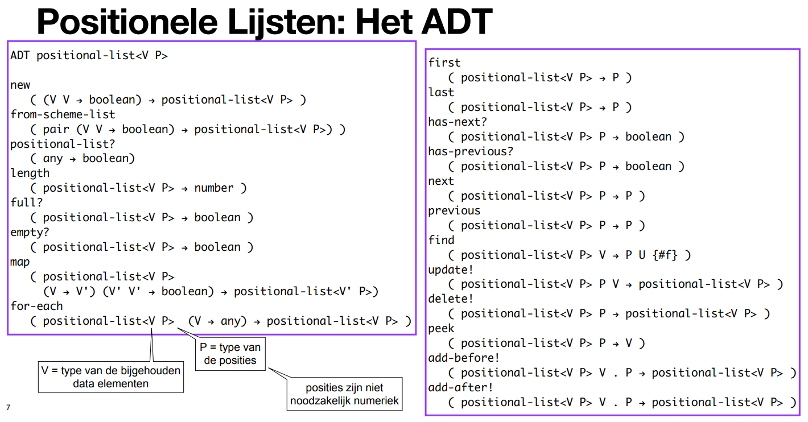

# Linear Datastructures

_Authors note: The course "Algorithms and Datastructures I" at the VUB uses the book "Algorithm and Data Structures in Scheme", this is not computers science in a pure form, but always in reference to Scheme programming langue, so any performance or implementation details, are referencing Scheme_

## Introduction

A linear datastructure is a datastructure where the elements are stored in a linear order. This means that each element has a unique predecessor and a unique successor. 

## Vector

One of the simplest ways to represent such a list in code is through a vector, sometimes called an 1d array. A vector is a datastructure which consists of a fixed number of elements, each with an unique index, that allows one to store and retrieve elements in constant time(`O(1)`) using the Scheme functions `vector-ref` and `vector-set!`.

For this preformance to be possible, the size of the vector must be known at creation. This means that the size of the vector cannot be changed after creation. When the size of the vector is not know upfront we must ether create a new vector with a size of one more than the original vector, and copy all the elements from the original vector to the new vector (called a storage move, `O(n)`), or we must upfront estimate the size of the vector, so that it is large enough to store any reasonable amount of elements, which means you might end up with unused space.

## List

In Scheme lists form an alternative to vectors. A list is a datastructure which consists of pairs, each with a reference to the next pair in the list. The last pair in the list has a reference to null. This means that the size of the list does not have to be known at creation, and can be changed after creation. Using `cons` one can  create and add a new it to an existing element in the list. 

However, using naked Scheme lists still has some drawbacks

## Problems

Common problems which 'standard' vectors and lists.
* Size must be know at creation
* Size cannot be changed after creation

* Inserting an element at the beginning of the list/vector is expensive
* 

In the following sections we will look at possible solutions to these problems.

## Headed List/Vectors

A headed list is a datastructure which consists of a header with a reference to the first pair in the list. Each pair in the list has a reference to the next pair in the list. The last pair in the list has a reference to null.

A headed vector is a datastructure witch consists of a header with a reference to the vector.

This header is capable of storing extra information about the list/vector, or contain functions which can be used on the list/vector. Below is an example ADT for a headed list/vector.

