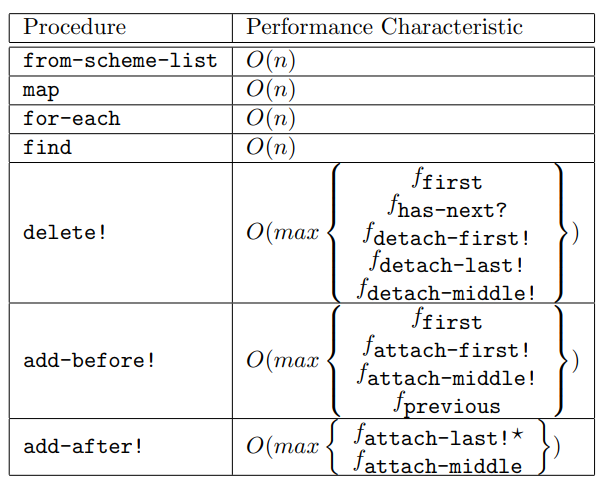
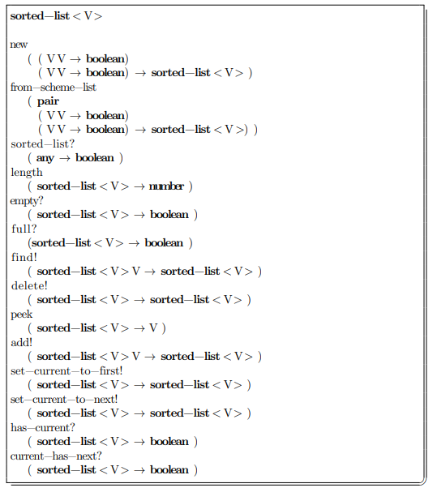
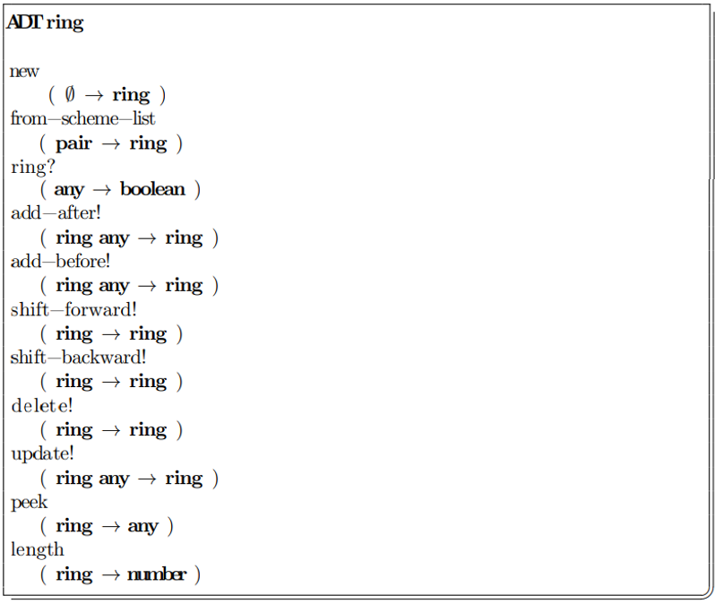

# Linear Datastructures

_Authors note: The course "Algorithms and Datastructures I" at the VUB uses the book "Algorithm and Data Structures in Scheme", this is not computers science in a pure form, but always in reference to Scheme programming langue, so any performance or implementation details, are referencing Scheme_

## Introduction

We define a linear data structure as a data structure in which each data element
has a unique position. The positions are linearly organized: this means that each
position has a unique next position as well as a unique previous position. There
are two exceptions to this rule: the first position is a special position that has
no previous position and the last position is a special position that has no next
position. A data structure that satisfies these properties will be referred to as
a **positional list**.

## Vector

One of the simplest ways to represent such a list in code is through a vector, sometimes called an 1d array. A vector is a datastructure which consists of a fixed number of elements, each with an unique index, that allows one to store and retrieve elements in constant time(`O(1)`) using the Scheme functions `vector-ref` and `vector-set!`.

For this preformance to be possible, the size of the vector must be known at creation. This means that the size of the vector cannot be changed after creation. When the size of the vector is not know upfront we must ether create a new vector with a size of one more than the original vector, and copy all the elements from the original vector to the new vector (called a storage move, `O(n)`), or we must upfront estimate the size of the vector, so that it is large enough to store any reasonable amount of elements, which means you might end up with unused space.

## List

In Scheme lists form an alternative to vectors. A list is a datastructure which consists of pairs, each with a reference to the next pair in the list. The last pair in the list has a reference to null. This means that the size of the list does not have to be known at creation, and can be changed after creation. Using `cons` one can  create and add a new it to an existing element in the list. 

However, using naked Scheme lists still has some drawbacks. There is no direct reference to the last pair in the list, so operation that add or change something at the end of the list can be very slow. So to add an element to the end of a list you have to iterate over the entire list. This means that adding an element to the end of a list is `O(n)`.

Also there are functions which are not generic, for example functions like `member` and `memv` use `eq?` to compare elements, so they will not work on lists of numbers or strings. This means that you have to write your own functions to search for elements in a list.

## Problems

Common problems which 'standard' vectors:
* Size must be know at creation
* Size cannot be changed after creation

Common problems which 'standard' lists:
* No direct reference to the last element in the list
* It is not possible to add elements tot the fornt of the list
* Adding an element to the end of the list is `O(n)`
* In Scheme lists are not generic


In the following sections we will look at possible solutions to these problems.

## Headed List/Vectors

The standart way of solving the problems of the standard scheme lists is to use a headed list. A headed list is a datastructure which consists of a header with a reference to the first pair in the list. Apart from that it stores some additional information, like the length of the list, and a reference to the last pair in the list. An example of a headed list is shown below:

```scheme
(define-record-type headed-list
    (make l i)
    headed-list?
    (l scheme-list scheme-list!)
    (i info info!))
```

This solves the problem of adding an element to the end of the list, because we now have a direct reference to the last pair in the list. This means that adding an element to the end of the list is now `O(1)`.

The headed list also solves the problem of adding an element to the front of the list, because we now have a reference to the first pair in the list, the first element in the list can be altered, by modifying the reference, instead of modifying the list itself. This can be done using the following code, using the record type defined earlier:

```scheme
(define (add-to-front! hl e)
  (scheme-list! hl (cons e (scheme-list hl))))
```
To make a headed list generic, and solve the final problem mentioned above, we can use a higher order compare function, which is stored in the header of the list. Alwing thses to be applied in the con struction of the list. 

It is also possible to use a headed vector, which solves the problems of the standard vectors. Similarly, these are data structures that consist of a header that maintains a reference to the actual vector in which the actual data elements reside. The contents of the header can be used to speed up some operations or to make the information in the vector more meaningful, e.g. by storing the counter that designates the last position in the vector that contains meaningful information.

## Positional List

A positional list is an implementation of a headed list, which is a datastructure which consists of a header with a reference to the first pair in the list. Apart from that it stores some additional information, like the length of the list, and a reference to the last pair in the list.  An ADT definition of a positional list is shown below:


The performancce characteristics of a positional list are shown below:



It possible to implement a positional list in such a way that all operations are `O(1)`, but this requires a lot of extra information to be stored in the header, which means that the header will be very large. This means that the memory usage of the positional list will be very high. The implementation is called an **improved doubly linked list**.

## Searching in linear datastructures

* Sequential search
* Sentinel search

### Sequential search

The sequential search algorithm searches th positional list by considering each element in the list one after the other, or in a sequence. The algorithm is shown below:

```scheme
(define (find plst key)
  (if (empty? plst)
      #f
      (let sequential-search
        (( curr (first plst)))
        (cond
          ((not (has-next? plst curr)) #f)
          ((eq? key (peek plstt curr)) curr) ; eq? can be replaced by a higher order compare function
          (else (sequential-search (next plst curr)))))))
```

Clearly the sequential search algorithm exibits a worst case performance of `O(n)`, because it has to consider each element in the list one after the other. The average case performance is `O(n/2)`, but this is still `O(n)`.

### Sentinel search

The sentinel search algorithm is a way of improving the sequential search algorithm. The algorithm is shown below:

```scheme
(define (find plst key)
  (if (empty? plst)
      #f
      (let 
        (attach-last! plst key) ; add a sentinel to the end of the list
        (let*
          ((pos (let sentinel-search
            ((curr (first plst)))
            (if (eq? (peek plst curr) key) ; eq? can be replaced by a higher order compare function
                curr
                (sentinel-search (next plst curr))))))
          (res (if (has-next? plst pos)
                 pos
                 #f)))
          (detach-last! plst (last plst)) ; remove the sentinel
          res)))) ; return the result
```

The algorithm works by adding a sentinel to the end of the list, which is a special element that is not part of the list. This means that the algorithm can stop when it finds the sentinel, instead of having to check if the next element is the last element in the list. This means that the worst case performance of the sentinel search algorithm is `O(n)`, still the sentinel search algorithm is faster than the sequential search algorithm, because it does not have to check if the next element is the last element in the list. This advantage can only be gained if `attach-last!` and `detach-last!` are `O(1)`.

### Sorted lists

Without any additional organization of the list, the only way to guarantee a correct answer from `find` is to keep on traversing the entire list as long as the key is not found. If the list is sorted, however, we can use the order of the elements to our advantage. If the key is smaller than the element we are currently considering, we know that the key cannot be in the rest of the list. This means that we can stop searching the list. Compared to the other linear datastructures, the takes away control from the user, because the user can't just add an element wherever they want, otherwise it won't be a sorted list anymore. An ADT definition of a sorted list is shown below:



Where we before had functions like `add-before` and `add-after`, these have been removed and replaced with `add`, which adds an element to the list in the correct position. 

The real advantage is when searching for an element in the list. The algorithm is shown below:

```scheme
(define (find! slst key)
  (define ==? (equality slst)) ; equality is a higher order compare function
  (define <<? (lesser slst)) ; lesser is a higher order compare function that decides how the list is sorted
  (define vect (storage slst))
  (define leng (size slst))
  (let sequential-search
    ((curr 0))
    (cond ((>= curr leng) 
       (current! slst -1)) 
      ((==? key (vector-ref vect curr)) ; Found it! 
       (current! slst curr))
      ((<<? (vector-ref vect curr) key) ; The key is smaller, so we look at the next element
       (sequential-search (+ curr 1))) 
      (else ; key is bigger than the current element, so it can't be in the list
       (current! slst -1)))) 
  slst)
```

The algorithm works by checking if the key is equal to the current element, if it is, the algorithm returns the current element. If the key is smaller than the current element, the algorithm returns `-1`, which means that the key is not in the list. If the key is larger than the current element, the algorithm continues to the next element in the list. This means that the worst case performance of the sorted list is `O(n)`, but the average case performance is `O(n/2)`, which is still `O(n)`.

### Binary search

To really take advantage of the fact that the list is sorted, we can use a binary search algorithm. The algorithm is shown below:

```scheme
(define (find! slst key)
  (define ==? (equality slst))
  (define <<? (lesser slst))
  (define vect (storage slst))
  (define leng (size slst))
  (let binary-search 
    ((left 0)
     (right (- leng 1)))
    (if (<= left right)
      (let ((mid (quotient (+ left right 1) 2)))
        (cond
          ((==? (vector-ref vect mid) key)
           (current! slst mid))
          ((<<? (vector-ref vect mid) key)
           (binary-search (+ mid 1) right))
          (else
           (binary-search left (- mid 1)))))
      (current! slst -1)))
  slst)
```

A more generic, camouflaged version of the algorithm, was given as a question on the exam, to see if the students could recognize the algorithm. I have removed the camouflage, and added some comments to explain the algorithm:

```scheme
(define (find! slst key)
  (define length (vector-length slst))
  (let binary-search
    ((left 0)
     (right (- length 1)))
    (if (<= left right)
     (let ((mid (div (+ left right 1) 2))) 
       (cond 
         ((= (vector-ref slst mid) key) ; Found it! 
           mid) ; Return the index of the element
         ((< (vector-ref slst mid) key) ; The key is larger then the current element,
           (loop-di-loop (+ mid 1) right)) ; so we look at the part right of the current element
         (else ; The key is smaller then the current element,
           (loop-di-loop left (- mid 1))))) ; so we look at the part left of the current element
     -1)))
``` 

The algorithm works by taking the middle element in a list and checking if the key is equal to that element, if it is, the algorithm returns the current element. If the key is smaller than the current element, the algorithm iterates over the left part of the list, if the key is larger than the current element, the algorithm iterates over the right part of the list. The algorithm stops when the current element is equal to the key, or when the left and right index are equal. If the left and right index are equal, in that case the algorithm returns `-1`, because the key is not in the list. This means that the algorithm has a worst case performance of `O(log(n))`, but the average case performance is `O(log(n/2))`, which is still `O(log(n))`, making it a lot faster than sequential search and sentinel search.

## Rings

A final ADT that is often associated with linearity is the ring ADT. A ring is a linear data structure in which every element has a next and a previous element. In contrast to positional lists, there are no exceptional elements that do not have a next or previous element. The ring ADT is shown below.

